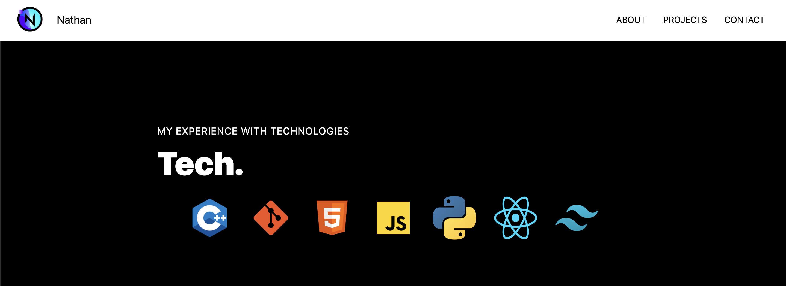

# My Portfolio Website

This is my personal portfolio website that showcases my skills, projects, and experience as a web developer. The website was built using React.js and Tailwind CSS, and is deployed using Vercel.

## Features

- **Responsive Design**: The website is optimized for all screen sizes, including mobile devices.
- **Project Showcase**: The Projects page displays my recent projects, with descriptions, screenshots, and links to live demos and source code repositories.
- **Skills and Experience**: The Skills and Experience page lists my relevant skills and work experience, as well as my education and certifications.
- **Contact Form**: The Contact page includes a simple form that visitors can use to get in touch with me.

## Credits

- [React.js](https://reactjs.org/)
- [Tailwind CSS](https://tailwindcss.com/)
- [Vercel](https://vercel.com/)
- [JavaScript Mastery](https://www.youtube.com/@javascriptmastery)

## License

This project is licensed under the MIT License - see the [LICENSE.md](LICENSE.md) file for details.
